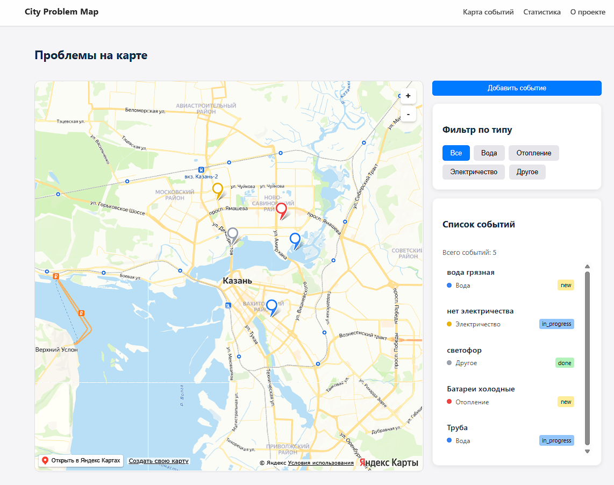
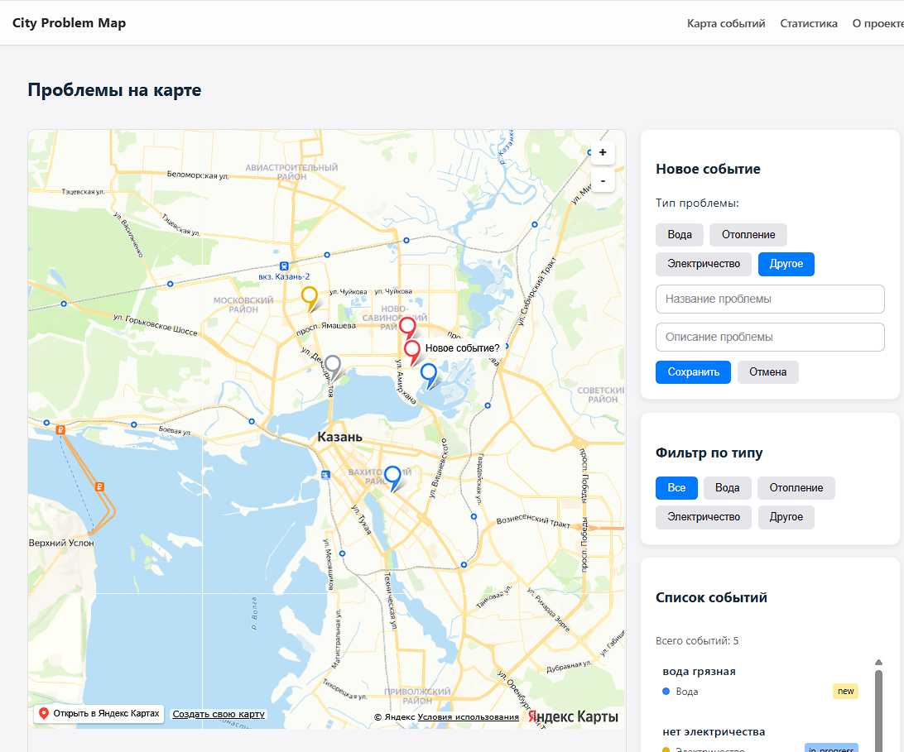
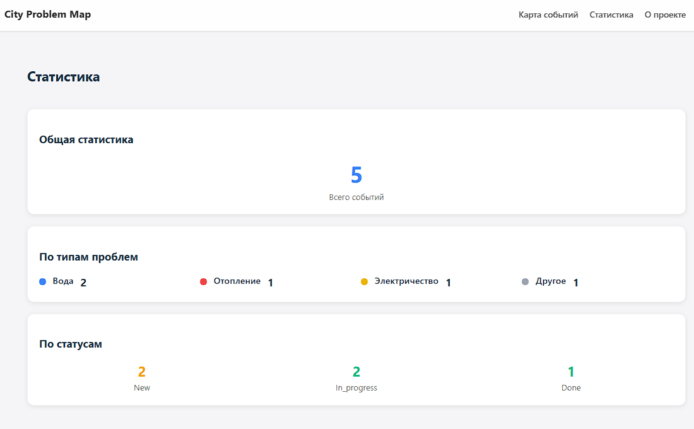
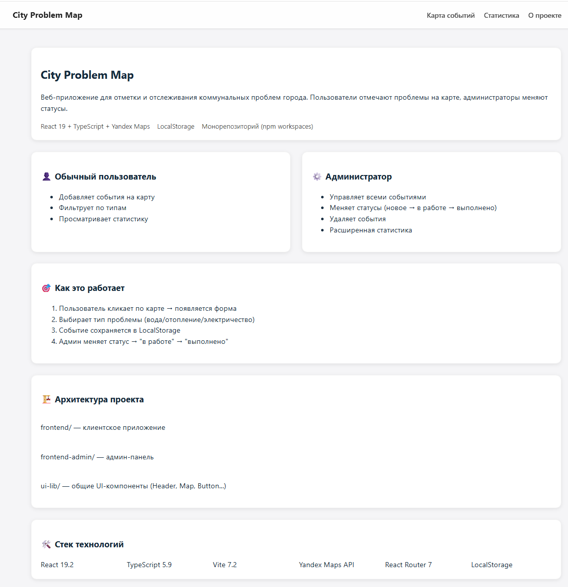
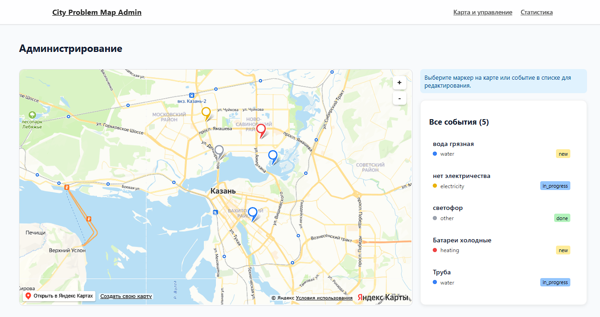
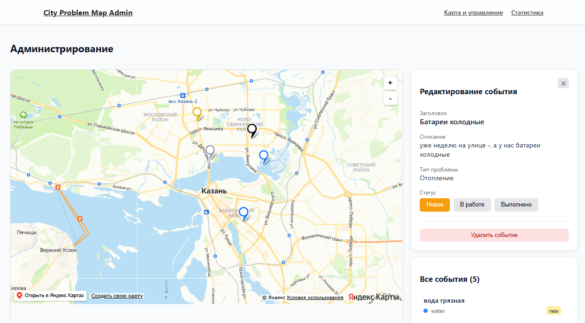

# City Problem Map

Курсовая работа "Разработка интерактивной карты для сбора отзывов о работе коммунальных служб с использованием JavaScript (React)" 
Приложение позволяет жителям города отмечать коммунальные проблемы на карте, а администраторам - отслеживать события и менять статус выполнения.

Проект реализован как монорепозиторий и состоит из трех пакетов: 
- `frontend` - Клиентское приложение
- `frontend-admin` - Панель администратора
- `ui-lib` - Библиотека общих компонентов

## Стек технологий
- **Core:** React 19, TypeScript 5.9, Vite 7
- **Routing:** React Router v7
- **Maps:** Yandex Maps API (`@iminside/react-yandex-maps` - подерживает React 19^)
- **State Management:** LocalStorage
- **Testing:** Jest
- **Linting:** ESLint

## Инструкция по запуску

### 1. Установка зависимостей
Выполните команду в корне проекта:

`npm install`

### 2. Запуск в режиме разработки
Проект использует npm workspaces. Для запуска в корневой папке используйте следующие команды: 

**Запуск пользовательского приложения(Frontend):**
`npm run dev -w frontend`

Приложение будет доступно по адресу: http://localhost:5173

**Запуск панели администратора (Admmin):**
`npm run dev -w frontend-admin`

Приложение будет доступно по адресу: http://localhost:5173

## Проверка качества кода
### Линтинг
Находясь в корневой директории запустите: `npm run lint -ws`

### Тестирование
Находясь в корневой папке запустите: `npm run test -ws`. Но тесты сделаны только для компонента Button.tsx из ui-lib. Поэтому coverage будет не ниже 90% только в папке ui-lib. 

Для проверки покрытия запустите `npm run test:coverage -ws`

### Проверка сборки
Для проверки сборки запустите команду `npm run build -ws`

## Сценарии работы

### 1. Добавление события (Пользователь)
1. Пользователь видит карту и список событий в городе.
2. Кликает на карте на место проблемы.
3. Открывается форма, где пользователь выбирает тип (Вода/Отопление/Электричество) и заполняет название проблемы и её описание.
4. Нажимает "Сохранить" — маркер появляется на карте.

### 2. Модерация (Администратор)
1. Администратор видит список всех проблем.
2. Кликает по маркеру на карте или по события из списка.
3. Меняет статус (Новое -> В работе -> Выполнено) или удаляет событие. 

## 🖼 Примеры работы (Скриншоты)

### Главная страница пользователя

### Форма добавления события

### Статистика пользователя

### Страница о проекте

### Панель администратора

### Форма работы с событием у администратора

### Статистика администратора такая же как в клиентской части